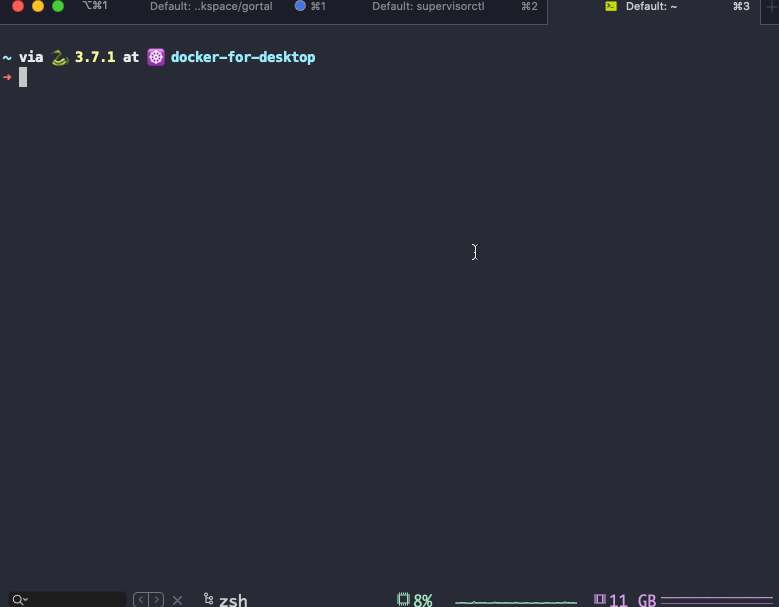

# gortal

[](https://github.com/TNK-Studio/gortal/actions)[](https://hub.docker.com/repository/docker/elfgzp/gortal)[](https://hub.docker.com/repository/docker/elfgzp/gortal)
[](https://hub.docker.com/repository/docker/elfgzp/gortal)[](https://github.com/TNK-Studio/gortal/releases)

A super lightweight jumpserver service developed using the Go language. [English Document](./README.md) | [中文文档](./doc/README_CN.md)



## Deployment

Gortal needs a server with a public IP as the server for the jumpserver service.
This server needs external network access to be able to access the target server you need to access.

### Docker

```shell
$ docker pull elfgzp/gortal:latest
$ mkdir -p ~/.gortal/.ssh
$ docker run \
  -p 2222:2222 \
  -v ~/.gortal:/root\
  -v ~/.gortal/.ssh:/root/.ssh\
  --name gortal -d gortal:latest
```

### Binary file

Download the version you need from the [Release] (https://github.com/TNK-Studio/gortal/releases) page, decompress it to get the `gortal` binary executable, and run it.

```shell
$ ./gortal
starting ssh server on port 2222...
```

## How to use

After the gortal service is started, an sshd service will be started on port `2222`. You can also set the startup port through `-p`.

After the service is started, you only need to use the `ssh` command to access the service.

```shell
$ ssh 127.0.0.1 -p 2222
root@127.0.0.1's password:
New Username: root█
Password: ******█
Confirm your password: ******█
Please login again with your new acount.
Shared connection to 127.0.0.1 closed.
```

The default user password for the first access is `newuser`, and then the command line prompts to create a new user. Follow the prompts to create a new `admin` account for the jumpserver service.

```shell
$ ssh root@127.0.0.1 -p 2222
root@127.0.0.1's password:
Use the arrow keys to navigate: ↓ ↑ → ←
? Please select the function you need:
  ▸ List servers
    Edit users
    Edit servers
    Quit
```

You can use it after logging in with your password again.